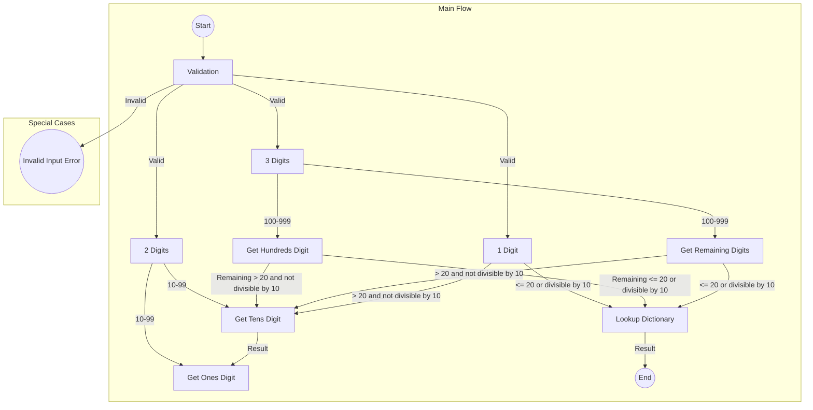
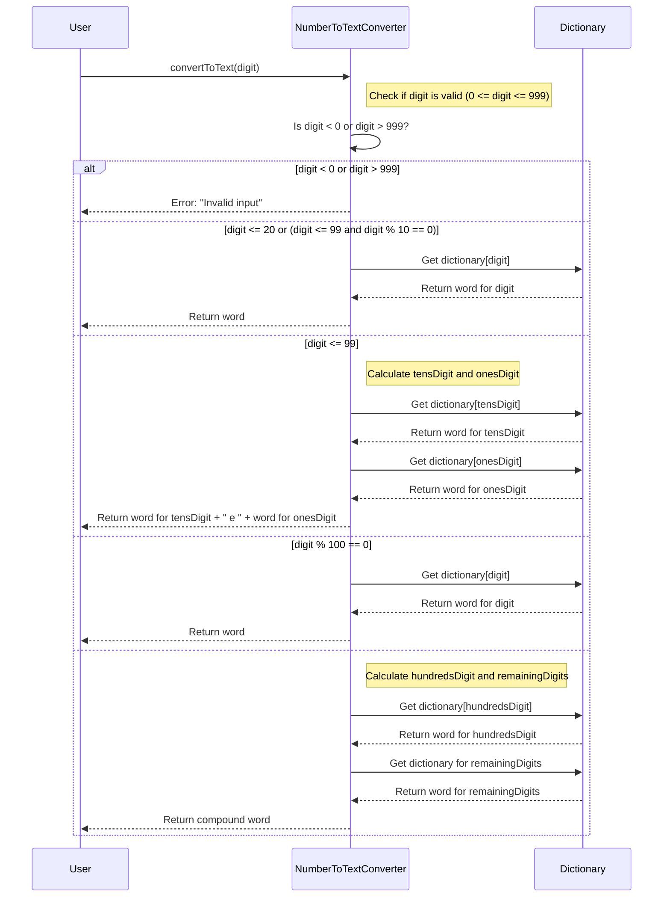
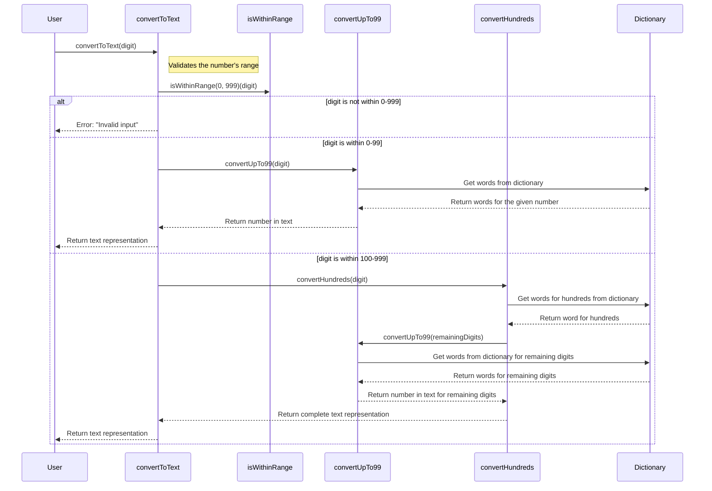
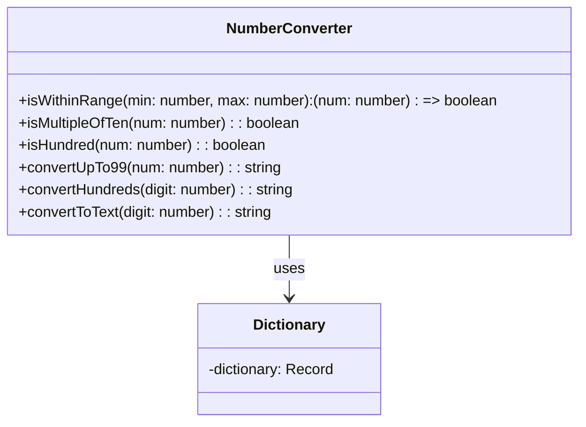

# Numbers to Brazilian Portuguese

An insightful overview of my quirky journey converting numbers into Brazilian Portuguese text

```
██████╗ ██╗   ██╗███████╗██████╗ ███████╗███╗   ██╗ ██████╗ ██╗███╗   ██╗███╗   ██╗███████╗██████╗
██╔═══██╗██║   ██║██╔════╝██╔══██╗██╔════╝████╗  ██║██╔════╝ ██║████╗  ██║████╗  ██║██╔════╝██╔══██╗
██║   ██║██║   ██║█████╗  ██████╔╝█████╗  ██╔██╗ ██║██║  ███╗██║██╔██╗ ██║██╔██╗ ██║█████╗  ██████╔╝
██║   ██║╚██╗ ██╔╝██╔══╝  ██╔══██╗██╔══╝  ██║╚██╗██║██║   ██║██║██║╚██╗██║██║╚██╗██║██╔══╝  ██╔══██╗
╚██████╔╝ ╚████╔╝ ███████╗██║  ██║███████╗██║ ╚████║╚██████╔╝██║██║ ╚████║██║ ╚████║███████╗██║  ██║
 ╚═════╝   ╚═══╝  ╚══════╝╚═╝  ╚═╝╚══════╝╚═╝  ╚═══╝ ╚═════╝ ╚═╝╚═╝  ╚═══╝╚═╝  ╚═══╝╚══════╝╚═╝  ╚═╝
```

## Table of Contents

- [Repository Initialization](#repository-initialization)
- [Run tests](#run-tests)
- [Numbers to PTBR Conversion - Step 1 - Jared (Interviewer) and Vinna (Procedural Edition)](#numbers-to-ptbr-conversion---step-1---jared-interviewer-and-vinna-procedural-edition)
  - [Problem Analysis](#problem-analysis)
  - [Initial Breakdown](#initial-breakdown)
  - [Skills Showcase](#skills-showcase)
  - [Technical Achievements](#technical-achievements)
  - [Forward Focus](#forward-focus)
- [Refactoring:](#refactoring)
  - [Scope Change - Must correct the dictionary (to make my life easier)](#scope-change---must-correct-the-dictionary-to-make-my-life-easier)
  - [Limitations of the Original Approach](#-limitations-of-the-original-approach)
  - [Refactoring Insights & Enhancements](#-refactoring-insights--enhancements)
- [Numbers to PTBR Conversion - OO & SOLID](#numbers-to-ptbr-conversion---oo--solid)
  - [Skills Showcase](#skills-showcase-1)
  - [Technical Achievements](#technical-achievements-1)
  - [Forward Focus](#forward-focus-1)
- [Numbers to PTBR Conversion - Functional Programming](#numbers-to-ptbr-conversion---functional-programming)
  - [Skills Showcase](#skills-showcase-2)
  - [Technical Achievements](#technical-achievements-2)
  - [Forward Focus](#forward-focus-2)
- [Exploring: Combining Functional Programming and Object-Oriented Design through Practical Modeling:](#exploring-combining-functional-programming-and-object-oriented-design-through-practical-modeling)
  - [Skills Showcase and Learning Achievements](#skills-showcase-and-learning-achievements)
- [My References](#my-references)

## 🚀 Repository Initialization

```
npm install
```

## 🧪 Run tests

```
npm test
```

## 💡 Numbers to PTBR Conversion - Step 1 - Jared (Interviewer) and Vinna (Procedural Edition)

- [Link to file](https://github.com/ViniciusVinna/codding-challange-latitud/blob/main/src/number-to-ptbr.ts)

### 📊 Problem Analysis

When tasked with the challenge of converting numbers to words, it became clear that a systematic breakdown was required. My initial notes indicated a strict input range: 0 to 999. The translation approach varied based on the digit count.

### 📋 Initial Breakdown

- **Validation**:
  - First step: Ensure input is between 0 and 999. Crucial for keeping everything within the problem's scope.
- **Digit Identification**:
  - 1 Digit (0-9): Straightforward. I fetched its word representation directly.
  - 2 Digits (10-99): Numbers 10-19 needed special attention due to unique wordings. Beyond that, it was about identifying tens and ones.
  - 3 Digits (100-999): Split the number at the hundreds' place. The remaining two digits were further broken down.
- **Dictionary Lookup**:
  - Once digits were isolated, I referred to a predefined dictionary for the word representation.



### 🎩 Skills Showcase

| Emoji | Skill                    | Technical Arena           | Proficiency Description         | Knowledge Tree                                 |
| ----- | ------------------------ | ------------------------- | ------------------------------- | ---------------------------------------------- |
| 💡    | Domain Knowledge         | Problem Domain            | Expertise in number translation | `Localization`, `Internationalization`, `L10N` |
| 🚀    | TypeScript               | Programming Languages     | Advanced TypeScript development | `ES6+`, `Transpilers`, `Type Definitions`      |
| 🧠    | Programming Logic        | Algorithms & Logic        | Robust logical implementation   | `Problem Solving`, `Patterns`, `Optimization`  |
| 📚    | Data Structures (Record) | Data Structure Management | Mastery over Record usage       | `Hashmaps`, `Linked Lists`, `Queues`, `Trees`  |
| 🧵    | String Manipulation      | Text Processing           | Efficient string manipulation   | `RegEx`, `Parsing`, `Tokenization`             |
| 📝    | Best Coding Practices    | Software Craftsmanship    | Consistent clean code producer  | `DRY`, `SOLID`, `Code Review`, `Refactoring`   |
| 🧪    | Unit Testing             | Software Testing          | Comprehensive unit tests        | `TDD`, `Mocking`, `Assertions`, `Coverage`     |

### 🌟 Technical Achievements

- Demonstrates a strong foundation in converting numbers to text.
- The procedural approach effectively handles different scenarios.

### 🔍 Forward Focus

- Explore alternative paradigms to simplify and enhance the code.
- Eager to delve into newer paradigms to further refine and enhance the codebase.

## 🛠️ Refactoring

The initial code worked on the following premise:

- Check the range of the number.
- Identify the number of digits.
- Use conditional logic to map different number ranges to their corresponding text.

### ❗ Scope Change - Must correct the dictionary (to make my life easier)

- [Portuguese linguistic rule](https://www.dicio.com.br/setecentos-ou-setecentos/)
- [Diff](https://github.com/ViniciusVinna/codding-challange-latitud/commit/2b4ecce2619d6e78c077efbb7264d6d186ef7c93#diff-9c48c39d3912cfe6fb6053a118fd8abdcca2ccd45ace49baacb0e7083b7c2233)

---

### ❗ Limitations of the Original Approach

| Emoji | Limitation                | Description                                                                                      |
| :---: | ------------------------- | ------------------------------------------------------------------------------------------------ |
|  🚧   | Multiple Responsibilities | The function handled multiple roles: input validation, dictionary lookup, and string formatting. |
|  💾   | Memory Efficiency         | Created unnecessary temporary variables for extracting digits.                                   |
|  ⛓️   | Scalability Issues        | Extending the function would be challenging.                                                     |
|  🔁   | Redundant Code            | Multiple checks for similar number ranges.                                                       |

### 🧐 Refactoring Insights & Enhancements

| Emoji | Insight/Enhancement        | Description                                                       |
| ----- | -------------------------- | ----------------------------------------------------------------- |
| 🏢    | Class Introduction         | Introduced NumberToTextConverter class for streamlined code.      |
| 🎯    | Single Responsibility      | Divided tasks for the Single Responsibility Principle.            |
| 🔐    | Encapsulation              | Dictionary encapsulation promoted data integrity.                 |
| 💾    | Memory Efficiency          | Direct computation of tens and ones places enhanced memory usage. |
| ✨    | Usability                  | Implemented a user-friendly interface.                            |
| 📚    | Adherence to SOLID         | Ensured each class and method had a singular task.                |
| ✅    | Input Validation           | Validated inputs to be within the 0-999 range.                    |
| 🔍    | Modularization             | Broke down the translation process based on digits.               |
| 🧹    | Redundant Code Elimination | Streamlined redundant checks.                                     |
| 📖    | Dictionary-Based Approach  | Used a dictionary for direct lookups.                             |
| 👓    | Enhanced Readability       | Structured for greater clarity and potential enhancements.        |

---

## 🧪 Numbers to PTBR Conversion - OO & SOLID

- [Link to file](https://github.com/ViniciusVinna/codding-challange-latitud/blob/main/src/number-to-ptbr.oo-solid.ts)

🛠️ **Code Improvements**: I've enhanced the code by incorporating concepts from esteemed authors and foundational programming principles:

🎯 **Single Responsibility Principle (SRP)**: Inspired by Robert C. Martin (Uncle Bob 🧔), I introduced the `NumberToTextConverter` class with the sole mission of converting numbers to text. As per SRP, every class should have only a single reason to undergo change.

🔒 **Encapsulation**: With teachings from experts like Bertrand Meyer 📚, I've concealed the dictionary as a private field inside `NumberToTextConverter`. This principle prioritizes data protection and segregation.

🚀 **Memory Efficiency**: In a bid to streamline memory use, I sidestepped superfluous array constructions and computed the tens and ones digits directly.

🖥️ **User-Friendly Design**: I've geared towards a user-oriented approach by permitting users to instantiate `NumberToTextConverter` and invoke the `convertToText` method. Such a design, rooted in usability paradigms, boosts both code legibility and adaptability.



### 🎩 Skills Showcase

| Emoji | Skill                          | Technical Arena               | Proficiency Description                                | Knowledge Tree                                             |
| ----- | ------------------------------ | ----------------------------- | ------------------------------------------------------ | ---------------------------------------------------------- |
| 💡    | Domain Knowledge               | Problem Domain                | Expertise in number translation                        | `Localization`, `Internationalization`, `L10N`             |
| 🚀    | TypeScript Development         | Programming Languages         | Advanced TypeScript development                        | `ES6+`, `Transpilers`, `Type Definitions`                  |
| 🧠    | Algorithm Design               | Algorithms & Logic            | Crafting efficient logic paths                         | `Flow Control`, `Branching`, `Loops`, `Recursion`          |
| 📚    | Records & Dictionaries         | Data Structure Management     | Deep understanding of key-value pairs                  | `Hashmaps`, `Dictionaries`, `KeyValue Arrays`              |
| 🧵    | Textual Representation         | Text Processing               | Efficiently converting numbers to text representations | `String Interpolation`, `Concatenation`                    |
| 📝    | Modularization & Decomposition | Software Craftsmanship        | Breaking problems into manageable modules              | `Modularity`, `Encapsulation`, `Separation of Concerns`    |
| 🧪    | Error Handling                 | Robustness & Error Management | Ensuring software robustness against invalid inputs    | `Exceptions`, `Validation`, `Boundary Tests`               |
| 🎨    | Software Design Patterns       | Design Patterns               | Application of best-fit patterns                       | `Singleton`, `Factory`, `Observer`, `Strategy`             |
| 🔄    | Flow Control                   | Logic Structuring             | Directing the logical flow of programs                 | `Conditionals`, `Sequences`, `Branch Decisions`            |
| 📈    | Optimization                   | Performance Improvement       | Enhancing code for better efficiency                   | `Memory Management`, `Loops`, `Direct Calculations`        |
| 🛠️    | Tooling & Transpilation        | Development Environments      | Advanced tool usage for TypeScript development         | `Compilers`, `Bundlers`, `Webpack`, `Babel`                |
| 💼    | Domain-Driven Design           | Software Architecture         | Designing based on domain specifics                    | `Entities`, `Value Objects`, `Aggregates`, `Domain Events` |
| 🎯    | Targeted Development           | Application Targeting         | Focusing on application specific needs                 | `Localization Targeting`, `Platform Specific Development`  |

### 🌟 Technical Achievements

- **Domain Mastery**: Deep understanding of the number-to-text translation problem domain, enabling the creation of efficient and accurate solutions.
- **Advanced TypeScript**: Skillful use of TypeScript features, ensuring type safety, code readability, and maintainability.
- **Algorithm Design**: Successfully transformed a simple logic problem into a robust and efficient algorithm, handling edge cases and optimizing performance.
- **Optimized Memory Usage**: By avoiding unnecessary variables and direct calculations, achieved a leaner codebase with reduced memory footprint.
- **Software Design Patterns**: Successfully applied suitable design patterns, ensuring modular, scalable, and maintainable code.
- **Error Handling**: Developed a system resilient to invalid inputs, enhancing software robustness and user experience.

### 🔍 Forward Focus

- **Expand Number Range**: Plans to expand the number range, allowing translations beyond 999, catering to more diverse use cases.
- **Multilingual Support**: Aiming to add support for multiple languages, enhancing the utility of the converter globally.
- **Optimization**: Constantly on the lookout for further optimization opportunities, ensuring the most efficient solution.
- **Integration with Other Systems**: Considering options to integrate the converter into larger systems, like localization platforms or educational software.
- **Enhanced User Interface**: While the current focus is on backend logic, there's an ambition to create an intuitive user interface, making it accessible to a wider audience.

---

## 🌐 Numbers to PTBR Conversion - Functional Programming

- [Link to file](https://github.com/ViniciusVinna/codding-challange-latitud/blob/main/src/number-to-ptbr.functional.ts)

I decided to refactor this code to make it clearer, more modular, and aligned with the principles of functional programming. Here's the reasoning behind the changes and an explanation of the concepts involved:

📖 **Mapping Dictionary**: I started by defining a dictionary that maps numbers to their text representations. This is essential because it allows me to associate numeric values with corresponding words, simplifying the conversion.

🔄 **Higher-Order Functions**: I noticed that I could create reusable functions to check ranges, multiples, and other conditions. So, I created higher-order functions like `isWithinRange`, `isMultipleOfTen`, and `isHundred`. These functions take arguments and return other functions that perform the checks, making the code more modular and flexible.

✨ **Pure Functions and Immutability**: Functional programming values pure functions that have no side effects and always produce the same result for the same inputs. This is crucial for code clarity and predictability. I also embraced data immutability, ensuring that data isn't modified after creation. This is evident in functions like `convertUpTo99` and `convertHundreds`.

🧱 **Function Composition**: Function composition is a central concept of functional programming. I used it to build representations of larger numbers by combining representations of smaller ones. For example, the `convertHundreds` function combines representations of hundreds, tens, and units for larger numbers.

⚠️ **Exception Handling**: I integrated exception handling to deal with invalid inputs. This is important to ensure that the code handles unexpected cases appropriately, increasing robustness.

🔍 **Clarity and Abstraction**: Lastly, by adopting functional programming concepts, I managed to make the code clearer and more abstract. This is evident in functions that succinctly describe the conversions of numbers to text in a readable manner.



### 🎩 Skills Showcase

| Emoji | Skill                     | Technical Arena               | Proficiency Description                                    | Knowledge Tree                                                |
| ----- | ------------------------- | ----------------------------- | ---------------------------------------------------------- | ------------------------------------------------------------- |
| 🧙‍♂️    | Functional Paradigms      | Programming Methodology       | Expertise in pure functional programming patterns          | `Higher-Order Functions`, `Pure Functions`, `Immutability`    |
| 🔍    | Range Validation          | Logic Structuring             | Crafting precise range check functions                     | `Boundaries`, `Conditional Checks`, `Logic Composition`       |
| 📖    | TypeScript Typing         | Programming Languages         | Leveraging TypeScript for type safety and clarity          | `Type Annotations`, `Function Types`, `Type Inference`        |
| 📚    | Dictionary Lookups        | Data Structure Management     | Efficiently using dictionary structures for data retrieval | `Key-Value Lookup`, `Associative Arrays`, `Object Properties` |
| 🔄    | Modular Logic             | Software Decomposition        | Breaking complex logic into reusable functions             | `Function Decomposition`, `Separation of Concerns`            |
| 🛠️    | Exception Handling        | Robustness & Error Management | Graceful handling of unexpected scenarios                  | `Error Throws`, `Conditional Checks`, `Boundary Tests`        |
| 🎯    | Precision & Detail        | Code Quality                  | Crafting precise and detailed logic paths                  | `Conditional Branching`, `Logical Operators`, `Flow Control`  |
| 🧠    | Mathematical Computations | Algorithms & Logic            | Implementing mathematical computations and checks          | `Modulus Operation`, `Rounding`, `Number Manipulations`       |

### 🌟 Technical Achievements

- **Functional Programming Mastery:** Demonstrated the adept use of higher-order functions to encapsulate logic, as evidenced by the `isWithinRange` function which returns another function to check a number's validity.

- **Textual Conversion Proficiency:** Successfully developed a mechanism to convert numeric inputs into their textual representations by interfacing with a dictionary module, highlighting the skills in textual representation and data structure management.

- **Error Management:** Integrated robust error handling using exceptions to ensure the function `convertToText` responds appropriately to out-of-range inputs, ensuring software resilience.

- **Modular Design:** Displayed proficiency in modularization and decomposition by creating distinct functions (`convertUpTo99`, `convertHundreds`, and range checkers) that break down the problem into smaller, more manageable pieces.

- **Algorithmic Efficiency:** Crafted efficient logic paths to ascertain the correct textual representation of numbers, making optimal use of conditional checks and mathematical operations.

### 🔍 Forward Focus

- **Expand on Data Structures:** While the current implementation utilizes a dictionary for translation, exploring other data structures like trees could further optimize lookup times for large datasets.

- **Enhance Functional Techniques:** Delve deeper into functional programming paradigms, exploring concepts like currying, monads, and lenses to further refine and modularize the codebase.

- **Integration with UI/UX:** Consider developing a user-friendly interface for this number-to-text conversion, catering to a wider audience and enhancing user experience.

- **Localization and Internationalization:** The current dictionary can be expanded to support multiple languages, allowing for seamless translation across different linguistic domains.

## 🌐🏭 Exploring: Combining Functional Programming and Object-Oriented Design through Practical Modeling

I've had the opportunity to observe and gain insights into bridging the gap between functional programming and object-oriented design. This understanding was not confined to a single recent project but has evolved over time through continuous exploration and hands-on experience.

As I delved into various functional programming concepts and object-oriented design principles, I realized the potential for these two paradigms to coexist harmoniously in software development. This practical knowledge allowed me to comprehend and effectively represent system structures across different paradigms.

- One tangible example of this integration can be seen in the testing file: [number-to-ptbr.test.ts](https://github.com/ViniciusVinna/codding-challange-latitud/blob/main/src/number-to-ptbr.test.ts).

Moreover, my proficiency in using diverse modeling tools to create a UML class diagram demonstrates my commitment to enhancing software architecture visualization. I firmly believe that these skills will play a vital role in facilitating effective communication and collaboration within any team, regardless of the project's nature or scope.



### 🎩 Skills Showcase and Learning Achievements

| Emoji | Skill                                   | Proficiency Description                             | Knowledge Acquired                                                                               |
| ----- | --------------------------------------- | --------------------------------------------------- | ------------------------------------------------------------------------------------------------ |
| 🚀    | **Functional Programming**              | Expertise in pure functional programming patterns   | 🪩 Bridge between functional and object-oriented programming paradigms                            |
| 🧮    | **Object-Oriented Design**              | Proficiency in object-oriented design principles    | 🪂 Recognition of harmony between different paradigms in software development                    |
| 🤝    | **Paradigm Integration**                | Blending functional and object-oriented programming | 🪁 Ability to unite contrasting paradigms to enhance software development                        |
| 📊    | **UML Modeling**                        | Creating UML class diagrams                         | 🌐 Proficiency in using diverse modeling tools to improve software architecture visualization    |
| 🎨    | **Software Architecture Visualization** | Enhancing architectural representation              | 🌟 Commitment to clear software architecture visualization, facilitating effective communication |
| 🎓    | **Practical Knowledge**                 | Continuous improvement through ongoing exploration  | 🌱 Demonstration of continuous learning and practical experience in skill development            |

## 🌟 Bonus: Regex & Functional Programming

- [Link to file](https://github.com/ViniciusVinna/codding-challange-latitud/blob/main/src/number-to-ptbr.regex.ts)

## 📚 My References

| Author(s)                                                                                                                                          | RPG Class          | Emoji | Level (1-100) | Specialty Area                               |
| -------------------------------------------------------------------------------------------------------------------------------------------------- | ------------------ | ----- | ------------- | -------------------------------------------- |
| [Robert C. Martin](https://www.amazon.com/Clean-Code-Handbook-Software-Craftsmanship/dp/0132350882)                                                | Code Knight        | 🛡️    | 95            | Software Craftsmanship & Agile Methodologies |
| [Erich Gamma, Richard Helm, Ralph Johnson, John Vlissides](https://www.amazon.com/Design-Patterns-Elements-Reusable-Object-Oriented/dp/0201633612) | Pattern Mages      | 🪄    | 98            | Object-Oriented Design & Design Patterns     |
| [Kyle Simpson](https://www.amazon.com/You-Dont-Know-Js-Scope/dp/1491904151)                                                                        | Script Sorcerer    | 📜    | 90            | JavaScript Depth & Nuances                   |
| [Martin Fowler](https://www.amazon.com/Refactoring-Improving-Design-Existing-Code/dp/0134757599)                                                   | Refactor Alchemist | ⚗️    | 96            | Code Refactoring & Enterprise Architecture   |
