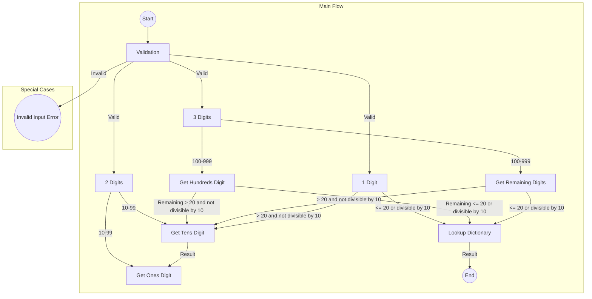

# Numbers to Brazilian Portuguese

```
npm install
```

### Run tests

```
npm test
```

## Numbers to PTBR - Procedural Way & Jared



## Refactors:

**Motivation**

**Scope Change - Must correct the dictionary (to make my life easier):**
https://www.dicio.com.br/setecentos-ou-setecentos/

**Original Code**: The initial code was a single function that converted numbers to text in Portuguese.

**Conditional Logic**: It used a series of conditional statements to handle different cases based on the input number's range and digits.

**Multiple Responsibilities**: The original code had multiple responsibilities, including input validation, dictionary lookup, and formatting of the textual representation.

**Limited Reusability**: It lacked reusability and maintainability since all the logic was contained within a single function.

**Memory Usage**: The code created unnecessary temporary variables and arrays for digit extraction, leading to less memory-efficient code.

**Refactoring Goal**: The goal of the refactoring was to make the code more organized, efficient, and aligned with SOLID principles.

**Creating a Class**: A new class called NumberToTextConverter was introduced to encapsulate the conversion logic.

**Single Responsibility**: The class adhered to the Single Responsibility Principle, focusing solely on number-to-text conversion.

**Encapsulation**: The dictionary of number-to-text mappings was encapsulated as a private field within the class to promote data encapsulation.

**Efficient Calculatio**n: The refactored code minimized memory usage by directly calculating tens and ones digits without creating unnecessary variables.

**Usability**: The new class offered a user-friendly interface, allowing users to create an instance and call the convertToText method for conversion.

**Alignment with SOLID**: The refactoring aligned the code with SOLID principles, ensuring that each class had a single responsibility and encouraging maintainability.

**Improved Code**: Overall, the refactoring resulted in cleaner, more efficient, and maintainable code, making it easier to work with and extend in the future.

### Number to PTBR - OO & Solid:

I've made some improvements to the code, following concepts from well-known authors and programming principles:

**Single Responsibility Principle (SRP)**: Inspired by _Robert C. Martin_ (_Uncle Bob_), I created a dedicated class, `NumberToTextConverter`, with the sole responsibility of converting numbers to text. _SRP suggests that each class should have only one reason to change_.

**Encapsulation**: I encapsulated the dictionary as a _private field_ within _NumberToTextConverter_. This concept, promoted by various authors, including _Bertrand Meyer_, emphasizes data hiding and isolation.

**Memory Efficiency**: To optimize _memory_ usage, I avoided unnecessary array creation and directly calculated tens and ones digits.

**User-Friendly Design:** I aimed for _user-friendliness_ by allowing users to create an instance of _NumberToTextConverter_ and call the _convertToText_ method. This design, inspired by usability principles, enhances code readability and reusability.

### Number to PTBR - Functional Programming:

I decided to refactor this code to make it clearer, more modular, and aligned with the principles of functional programming. Here's the reasoning behind the changes and an explanation of the concepts involved:

**Mapping Dictionary**:
I started by defining a dictionary that maps numbers to their text representations. This is essential because it allows me to associate numeric values with corresponding words, simplifying the conversion.

**Higher-Order Functions**:
I noticed that I could create reusable functions to check ranges, multiples, and other conditions. So, I created higher-order functions like `isWithinRange`, `isMultipleOfTen`, and `isHundred`. These functions take arguments and return other functions that perform the checks, making the code more modular and flexible.

**Pure Functions and Immutability**:
Functional programming values pure functions that have no side effects and always produce the same result for the same inputs. This is crucial for code clarity and predictability. I also embraced data immutability, ensuring that data isn't modified after creation. This is evident in functions like `convertUpTo99` and `convertHundreds`.

**Function Composition**:
Function composition is a central concept of functional programming. I used it to build representations of larger numbers by combining representations of smaller ones. For example, the `convertHundreds` function combines representations of hundreds, tens, and units for larger numbers.

**Exception Handling**:
I integrated exception handling to deal with invalid inputs. This is important to ensure that the code handles unexpected cases appropriately, increasing robustness.

**Clarity and Abstraction**:
Lastly, by adopting functional programming concepts, I managed to make the code clearer and more abstract. This is evident in functions that succinctly describe the conversions of numbers to text in a readable manner.
